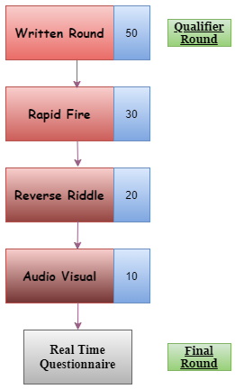

# Quizzeteria
Quizzeteria, resembling something like collection of quizzes and so it does!! This Competition consists of a spectacular collection of not mere quizzes but different activities which would be full of fun and learning. You may be aware of some quizzes in it but you have rarely seen them altogether. Performing those activities would be enchanting experience for all of us.

  
# Table of Contents
<!-- vscode-markdown-toc -->
* [Rounds](#rounds)
     * [Written Quiz](#wquiz)
     * [Rapid Fire](#rfire)
     * [Reverse Riddle](#rriddle)
     * [Audio Visual Round](#av)
     * [Real Time Questionnaire](#rquestion)
* [Table of Allocation](#toa)
* [Sponsors](#spons)

<!-- vscode-markdown-toc-config
    numbering=true
    autoSave=true
    /vscode-markdown-toc-config -->
<!-- /vscode-markdown-toc -->

  
# Rounds
The description of each round is as follows-

1. **Written Quiz:** Conducted on *Google forms*, this quiz would test the knowledge based capabilities of the participants. There would be a total of *30 questions* which need to be answered in about *15-20 mins*. Total of *50 teams* are to be selected after this quiz. *(tentative)*

2. **Rapid Fire**: As usual, teams would be asked a series of questions rapidly based upon a topic chosen from the list of provided topics. Topics list could contain *5 topics* of interest and selection of a topic is mandatory. Failing to do so would lead to start of the round with topics chosen by the instructor. The mode of this round would be a *Zoom meeting* in which participants would be required to keep their *video and audio* enabled. The ones who'd raise hand earlier would be given priority accordingly. There would be *10 slots* with *5 teams* in each slot (50 teams) and *10 questions* would be asked from each team. The total of *30 teams* are to be selected from this round.*(tentative)*

3. **Reverse Riddle**: The participants in this round would be given details or hints regarding a particular topic and they have to backtrack to form a *riddle* out of it. This round would be taken on *Zoom* itself. A total of *10 slots* with *3 teams* each would be formed. *2 riddles* would get selected from each slot giving it a total of *20 teams* being selected from this round.

4. **Audio Visual Round**: Extracting hints from an *Image or a Video*, the participants would be required to answer questions based upon it. This task could be over *Google Forms* or at *Zoom meeting* itself whichever would be preferable. Top *10 teams* would get selected in this round making their way to the final round viz **Real Time Questionnaire**.

5. **Real Time Questionnaire**: The participant teams would be asked a series of questions in real time by an instructor (or set of instructors). This would be a *1 x 1* round and all team members would be asked individually. The team with most fast and greater number of correct answers would get selected.

<b>Information of various Rounds at Quizzeteria.</b>

  
# Table of Allocation
|Topics| Department| Link|
|----| ----| ----|
|General Knowledge| Management| [Management](https://docs.google.com/document/d/1DSKd2srQ2bsPCFN9r3k72hxGc2fGXSFL9prp7OTgNTU/edit?usp=sharing)|
|Aptitude| CP| [Aptitude](https://docs.google.com/document/d/1uL7mYEHp1xszFHYL-ki7XXLHo0Gc3lvfVfaUNpySpL8/edit?usp=sharing)|
|History| Digital Marketing| [Digital Marketing](https://docs.google.com/document/d/1vSzwRwbOpUGp1RcOMIDWr1UiMOF5UINgZq5KYkh9RuE/edit?usp=sharing)|
|Mythology| Elektra| [Elektra](https://docs.google.com/document/d/1ENJkxrj70kHvJog54b1QhqJdzx6-mHORTpGiih9FDv4/edit?usp=sharing)|
|Current Affairs| Content and ideation| [Content & Ideation](https://docs.google.com/document/d/1AkU6XTUUUZsSCJtB1cLAGDmZuwSAuicMdG6iROQeidE/edit?usp=sharing)|
|Technology| Open Source| [Open Source](https://docs.google.com/document/d/138Dnkbz_-cRh6t9qr82q8GNZzTIgX7kFHYsAIe0BBHY/edit?usp=sharing)|
|Astronomy| CTIS| [CTIS](https://docs.google.com/document/d/1bmCU7gdH6MQfEqNwu-4eaAAZjjdBsV2eW0r1t9Pgdk0/edit?usp=sharing)|
|Sports| Web Development| [Web Development](https://docs.google.com/document/d/1e0mWjI90ImG2R9E8IX8dofQl6L3qL9D94VtR0u-iqLg/edit?usp=sharing)|
|Science| Mobile Development| [Mobile Development](https://docs.google.com/document/d/1H-Ex9ea1PP-m2afyrJL7FckfFCDVgGezPcGE26HkkAA/edit?usp=sharing)|
|Vocabulary/Grammar| Machine Learning| [Machine Learning](https://docs.google.com/document/d/1tr5HxPmEBPtd8CJbuN_pZkkF-gLHE58b_tO3lsuSJQE/edit?usp=sharing)|

  
#  Sponsors